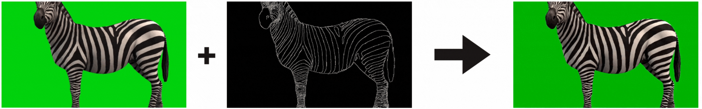

<div align="center">

# Goal Force: Teaching Video Models To Accomplish Physics-Conditioned Goals

[](https://arxiv.org/abs/2601.05848)
[](https://opensource.org/licenses/MIT)
[](https://goal-force.github.io/)

</div>

The official PyTorch implementation of the paper [**"Goal Force: Teaching Video Models To Accomplish Physics-Conditioned Goals"**](https://arxiv.org/abs/2601.05848). Please check out our [**project webpage**](https://goal-force.github.io/) for more details.


## Installation & Environment

<details>
  <summary><b> Create conda environment </b></summary>

<br>

This has been tested on: `Driver Version: 560.35.05   CUDA Version: 12.6`.

Create conda environment:
```bash
CONDA_ENV_DIR=${PWD}/conda-env
conda create -p $CONDA_ENV_DIR python=3.11 -y
conda activate $CONDA_ENV_DIR

# install torch
pip install --prefix=$CONDA_ENV_DIR torch==2.5.0 torchvision==0.20.0 torchaudio==2.5.0 --index-url https://download.pytorch.org/whl/cu121
# it's a good idea to check that the torch installation was successful
python -c 'import torch; print(torch.cuda.is_available()); a = torch.zeros(5); a = a.to("cuda:0"); print(a)'

# install all the other requirements
pip install -e . --prefix=$CONDA_ENV_DIR
```

</details>

<details>
  <summary><b> Activate conda environment </b></summary>

<br>

```bash
CONDA_ENV_DIR=${PWD}/conda-env
conda activate $CONDA_ENV_DIR
```
</details>

<details>
  <summary><b> Download base model (Wan 2.2) </b></summary>

<br>

This script runs inference using the base video model on an image of a cat.
It will download the weights in the process.
If this outputs a video, you'll know your setup works.

```bash
python scripts/inference/inference-Wan2.2-I2V-A14B-base-model-demo.py
```

</details>


## Inference: Goal Force
<details>
  <summary><b> Data preprocessing (custom scenes, optional) </b></summary>
<br>

If you want to run inference on your own images, then we recommend using the [Flask app](scripts/test_dataset_preprocessing/app_dataset_preprocessing.py) that we built for data preprocessing. This app provides a unified UI which takes care of the relevant details and generates the corresponding csv file for inference.

The app allows you to:
- Crop and resize images to the correct resolution (832x480) and aspect ratio
- Select pixel coordinates for projectile and target objects
- Set force angles and magnitudes for both projectile and target forces
- Upscale text prompts using OpenAI's API (requires an OpenAI API key)
- Generate CSV files in the correct format for inference

**Note:**
- In order to use the prompt upscaling part of our Flask app, you will need an OpenAI API key; we recommend creating a `.env` file and adding the line `OPENAI_API_KEY=<your_key>`.
- By default, the app saves the CSV file and the corresponding processed image to `datasets/custom_test`. Please ensure the path matches in the shell script when calling the inference.
- The app does not handle object mass explicitly. If you want to specify object mass instead of having it auto-inferred by the model, please go to the corresponding csv file and adjust the mass values manually (in the range of 1.0 to 4.0). By default the mass values are -1 for auto-inference.
- The `scripts/test_dataset_preprocessing/get_pixel.py` is useful for getting the x/y pixel coordinates if changes are needed.

<details>
  <summary><i>More details on the inference CSV format:</i> </summary>
<br>

The app generates CSV files with the following structure. Each CSV contains metadata for a single image with force specifications. For an example, see [`datasets/examples/multi-object-collision/_pendulum_obj1_prompt1.csv`](datasets/examples/multi-object-collision/_pendulum_obj1_prompt1.csv).

The CSV columns are:
- `image`: The image filename
- `projectile_force_angle`: Direct force angle, for the projectile (in degrees from 0 to 360, where 0° indicates right, 90° indicates up, etc.). Set to -1.0 if not specifying a projectile force (i.e., Goal Force Mode).
- `projectile_force_magnitude`: Direct force magnitude, for the projectile (in the range of 30 to 400). Set to -1.0 if not specifying a projectile force (i.e., Probabilistic Task Completion).
- `projectile_coordx`, `projectile_coordy`: Pixel coordinates of the projectile object. These values must be present in the CSV but are ignored (do not affect the control signal) if `projectile_force_magnitude` is -1.
- `projectile_mass`: Mass of the projectile (in the range of 1.0 to 4.0). Set to -1 (default) for auto-inference by the model.
- `target_indirect_force_angle`: Goal force angle, for contacting the target object (in degrees from 0 to 360, where 0° indicates right, 90° indicates up, etc.). Set to -1.0 if not specifying a goal force (i.e., Direct Force mode).
- `target_indirect_force_magnitude`: Goal force magnitude, for contacting the target object (in the range of 30 to 400). Set to -1.0 if not specifying a goal force (i.e., Direct Force mode).
- `target_coordx`, `target_coordy`: Pixel coordinates of the target object.
- `target_mass`: Mass of the target object (in the range of 1.0 to 4.0). Set to -1 (default) for auto-inference by the model.
- `width`, `height`: Image dimensions
- `caption`: Text prompt for the scene

**IMPORTANT:** For inference, you must specify exactly one force type per CSV row (either projectile force or target indirect (goal) force, but not both):
- For **Goal Force** (target indirect force): Set `projectile_force_magnitude` to -1.0 (the `projectile_force_angle` will be ignored). Set `projectile_mass` to -1 if doing Probabilistic Task Completion. Specify `target_indirect_force_angle` (0-360°) and `target_indirect_force_magnitude` (30-400). Optionally specify `target_mass` (1.0-4.0, or set to -1 for auto-inference).
- For **Direct Force** (projectile force): Set `target_indirect_force_magnitude` to -1.0 (the `target_indirect_force_angle` will be ignored). Set `target_mass` to -1. Specify `projectile_force_angle` (0-360°) and `projectile_force_magnitude` (30-400). Optionally specify `projectile_mass` (1.0-4.0, or set to -1 for auto-inference).

**Note:** The app writes two data rows per CSV by default: First one for direct force application, with projectile force active (target force set to -1), and the second one for goal force application, with target indirect force active (projectile force set to -1). The [example CSV files](datasets/examples) show goal force application only (the second generated row). During training, both forces can be specified (neither is -1), where one may be randomly masked out, but for inference you should use separate rows with one force type each.
</details>

<br>

To run the Flask app:

```bash
python scripts/test_dataset_preprocessing/app_dataset_preprocessing.py
```

**Tip:** If you're running this on a server using VSCode, then port forwarding will happen automatically and the flask app will work as intended. However, you can avoid latency issues by running locally—if you're preprocessing a lot of data you may find the latency burdensome.

</details>


<details>
  <summary><b> Download Goal Force checkpoint </b></summary>

<br>

Download our pretrained model by running:

```bash
python scripts/download_files/download_checkpoints.py
```

If download was successful, the checkpoint should be organized like this:

```
checkpoints/goal_force
└── step-3000.safetensors
```

</details>


<details>
  <summary><b> Run inference script </b></summary>

<br>

Running the following script will generate videos using your chosen checkpoint and image/text/goal force prompt (specified in the csv files). **This script will output videos into the same directory as the input model checkpoint.** For example, if you use the checkpoint `checkpoints/goal_force/step-3000.safetensors`, then the videos will be output into the directory `checkpoints/goal_force/step-3000-videos`.

```bash
sh scripts/inference/inference_goal_force.sh
```
</details>


## Training: Goal Force

<details>
  <summary><b> Download synthetic training data </b></summary>

<br>

If you want to train a model from scratch, then the following script will download all of our training data.

```bash
python scripts/download_files/download_datasets.py
```

The datasets will be downloaded and organized in the following structure:

```
datasets/
└── train/
    ├── balls_6k/          (video folder)
    ├── dominos_3k/        (video folder)
    ├── plants_3k/         (video folder)
    ├── balls_6k.csv
    ├── dominos_3k.csv
    └── plants_3k.csv
```

</details>


<details>
  <summary><b> Run training script </b></summary>

<br>

**Note:** We only train the high-noise model.

Training with 10 ControlNet layers takes less than 80 GB per GPU when using 4 GPUs.
When developing training, i.e. using 1 GPU, you'll need to decrease the number of ControlNet layers.

```bash
sh scripts/train/train_goal_force.sh
```

**Tip**: If your compute node does not have access to the internet, you can use the `--offline_load` flag in the shell script to prevent the code from accessing the internet to check for downloaded model weights.

</details>

<details>
  <summary><b> Resume training </b></summary>

<br>

```bash
sh scripts/train/resume_training_goal_force.sh
```

**Note:** Please make sure to specify the path to your model checkpoint in the shell script for resume.

</details>


## Bonus: Wan2.2+ControlNet for Canny edge control




We implemented a ControlNet on top of the high-noise expert of Wan2.2 as the architecture for Goal Force. We validated that our implementation works by first training it for Canny edge control. We release minimal training and inference code in case others find this model useful as a baseline.


<details>
  <summary><b> Download OpenVid-1M training data </b></summary>

<br>

The following script will download part of the OpenVid-1M dataset for training Canny edge control.

```bash
python scripts/download_files/download_OpenVid.py
```

The dataset will be downloaded and organized in the following structure:

```
datasets/OpenVid-1M/OpenVid-1M-train/
├── OpenVid-1M.csv
├── OpenVidHD.csv
├── download        (zip folder)
└── video           (video folder)
```

</details>


<details>
  <summary><b> Download Canny checkpoint </b></summary>

<br>

Download our pretrained model by running:

```bash
python scripts/download_files/download_checkpoints.py
```

If download was successful, the checkpoint should be organized like this:

```
checkpoints/wan2.2_controlnet_canny_edge
└── step-500.safetensors
```

Note that we only trained this for 500 steps, on a very non-diverse subset of the OpenVid-1M dataset. We're sharing this checkpoint as an end-to-end proof of concept, not because we've thoroughly tested it (although it does work on the examples we've tried / included in this repo).

</details>

<details>
  <summary><b> Run training script </b></summary>

<br>

**Note:** We only train the high-noise model.

Training with 10 ControlNet layers takes less than 80 GB per GPU when using 4 GPUs.
When developing training, i.e. using 1 GPU, you'll need to decrease the number of ControlNet layers.

```bash
sh scripts/train/train_canny_edge_control.sh
```

**Tip**: If your compute node does not have access to the internet, you can use the `--offline_load` flag in the shell script to prevent the code from accessing the internet to check for downloaded model weights.

The following script allows you to resume training from a checkpoint. 
**Note:** Please make sure to specify the path to your model checkpoint in the shell script for resume.

```bash
sh scripts/train/resume_training_canny_edge_control.sh
```


</details>

<details>
  <summary><b> Run inference script </b></summary>
<br>

The workflow is similar to the goal force model:

1. (Optional) **Prepare the CSV files for inference data.** Only do this step if you want to run inference on more examples than we include in the repo. We provide two auxiliary scripts in [`scripts/utils/`](scripts/utils/) that may be helpful:
   - `extract_canny_edges.py`: Extracts the canny edge conditioning video from a real video
   - `extract_first_frame.py`: Extracts the first frame from a real video
   
   Usage:
   ```bash
   python scripts/utils/extract_canny_edges.py -i input/path/to/video.mp4 -o output/path/to/video_canny.mp4 -n 81
   python scripts/utils/extract_first_frame.py -i input/path/to/video.mp4 -o output/path/to/video_first_frame.png
   ```

2. **Run the inference script with canny edge control.** We provide canny edge inference examples in [`datasets/examples/canny-edge-examples`](datasets/examples/canny-edge-examples) for reference. To run canny edge controlled inference on these examples, run the following script:

   ```bash
   sh scripts/inference/inference_canny_edge_control.sh
   ```
</details>


## Acknowledgments

We thank the authors of the works we build upon:
- [Wan 2.2 I2V Model](https://huggingface.co/Wan-AI/Wan2.2-I2V-A14B)
- [DiffSynth-Studio](https://github.com/modelscope/DiffSynth-Studio)
- [Force Prompting](https://github.com/brown-palm/force-prompting)

## Bibtex

If you find this code useful in your research, please cite:

```
@misc{gillman2026goalforceteachingvideo,
      title={Goal Force: Teaching Video Models To Accomplish Physics-Conditioned Goals}, 
      author={Nate Gillman and Yinghua Zhou and Zitian Tang and Evan Luo and Arjan Chakravarthy and Daksh Aggarwal and Michael Freeman and Charles Herrmann and Chen Sun},
      year={2026},
      eprint={2601.05848},
      archivePrefix={arXiv},
      primaryClass={cs.CV},
      url={https://arxiv.org/abs/2601.05848}, 
}
```
