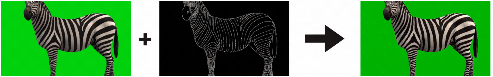

<div align="center">

# Goal Force: Teaching Video Models To Accomplish Physics-Conditioned Goals

[](https://arxiv.org/abs/2601.05848)
[](https://opensource.org/licenses/MIT)
[](https://goal-force.github.io/)

</div>

The official PyTorch implementation of the paper [**"Goal Force: Teaching Video Models To Accomplish Physics-Conditioned Goals"**](https://goal-force.github.io/). Please check out our preprint [**(arXiv link)**](https://arxiv.org/abs/2601.05848) for more details.


**Code coming soon!**


## Bonus: Wan2.2+ControlNet for Canny edge control




We implemented a ControlNet on top of the high-noise expert of Wan2.2 as the architecture for Goal Force. We validated that our implementation works by first training it for Canny edge control. We release minimal training and inference code in case others find this model useful as a baseline.

**Code for this coming soon as well!**

## Acknowledgments

We thank the authors of the works we build upon:
- [Wan 2.2 I2V Model](https://huggingface.co/Wan-AI/Wan2.2-I2V-A14B)
- [DiffSynth-Studio](https://github.com/modelscope/DiffSynth-Studio)
- [Force Prompting](https://github.com/brown-palm/force-prompting)

## Bibtex

If you find this code useful in your research, please cite:

```
@misc{gillman2026goalforceteachingvideo,
      title={Goal Force: Teaching Video Models To Accomplish Physics-Conditioned Goals}, 
      author={Nate Gillman and Yinghua Zhou and Zitian Tang and Evan Luo and Arjan Chakravarthy and Daksh Aggarwal and Michael Freeman and Charles Herrmann and Chen Sun},
      year={2026},
      eprint={2601.05848},
      archivePrefix={arXiv},
      primaryClass={cs.CV},
      url={https://arxiv.org/abs/2601.05848}, 
}
```
